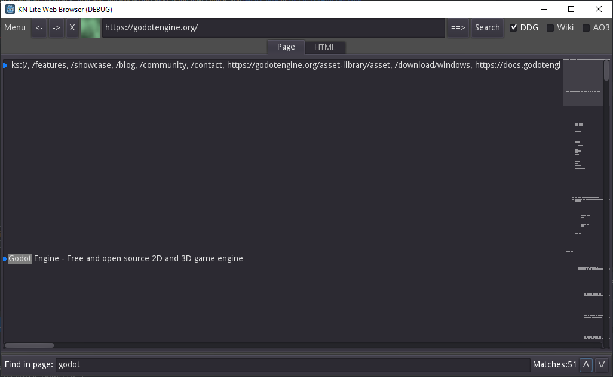

# Lite Web Browser
Made with: [Emi's Tutorial](https://www.youtube.com/watch?v=URszvAXXzFs)
 

## Using:
For Windows and Linux currently, Mac users will need to make their own version as notarizing is tricky.

The "==>" button inputs a web link. While "search" takes a single term and applies it to either Duck Duck Go, Wikipedia, or Archive of Our Own.

## Goals:
Basic Page Rendering
Basic CSS (at least what is easy with Godot's UI nodes)
Basic Javascript (Enable with checkbox)\
Video Streaming 

## Final Goal:
Be a lightweight tool for browsing the web, without major caveat.
